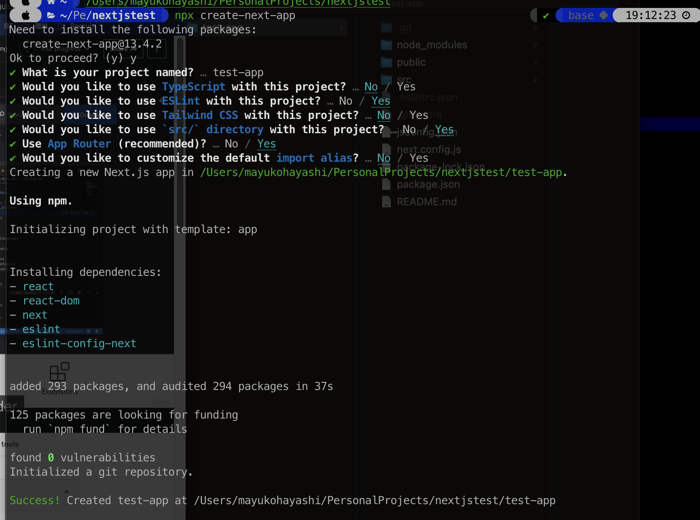

## Analyze Create project

### 作成

- node.js: 18.6.0
- `npx create-next-app`



### ファイル構成

``` bash
.
└── test-app
    ├── .eslintrc.json
    ├── .git
    ├── .gitignore
    ├── README.md
    ├── jsconfig.json
    ├── next.config.js
    ├── node_modules
    ├── package-lock.json
    ├── package.json
    ├── pages
    ├── styles
    ├── public
    │   ├── next.svg
    │   └── vercel.svg
    └── src
        └── app
```

- pages: ページのルーティング
- public: 静的ファイル
  - Next.js allows us to determine WHEN a page should be pre-rendered. BUT we're going to learn that step by step!
- src: アプリケーションのソースコード
- styles: CSS
- .gitignore: gitの管理対象外のファイルを指定する
- .eslintrc.json: ESLintの設定ファイル
- jsconfig.json: TypeScriptの設定ファイル
- next.config.js: Next.jsの設定ファイル
- package.json: プロジェクトの設定ファイル
- package-lock.json: パッケージのバージョンを固定するためのファイル
- node_modules: パッケージのインストール先

---
