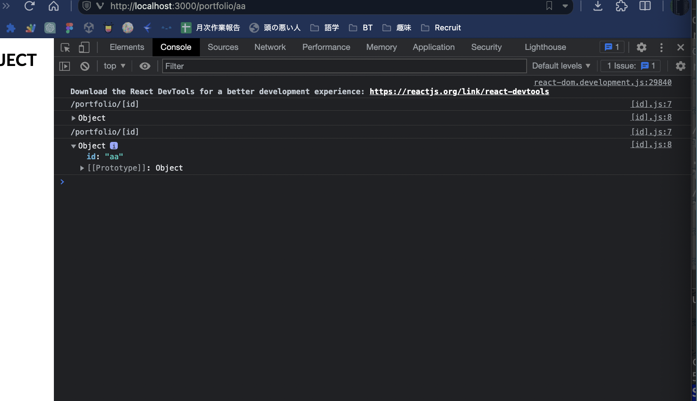
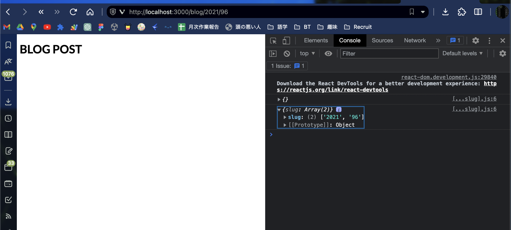

# Routing

## Understanding Fle-based Routing

### File-based Routing Instead Of Code-based Routing

- No react-router
- no in-code route definitions

★ Create React component files and let NextJS infer the routes from the file system(= folder structure)

### How It Works

```
/pages
  /index.js : Main stating page(my-domain.com/)
  /about.js : About page(my-domain.com/about)

  /products
    /index.js : All products page(my-domain.com/products)
    /[id].js : Single product detail page(my-domain.com/products/<id>)
```



このように、適当な値をいれてもそこをidとして認識。(= `router.query`)
→ can send a request to some backend server, and to fetch the piece of data with an id of `router.query.id`



JSとおなじように`...`も使える

## Static & Dynamic Routes

## Navigating Between pages
